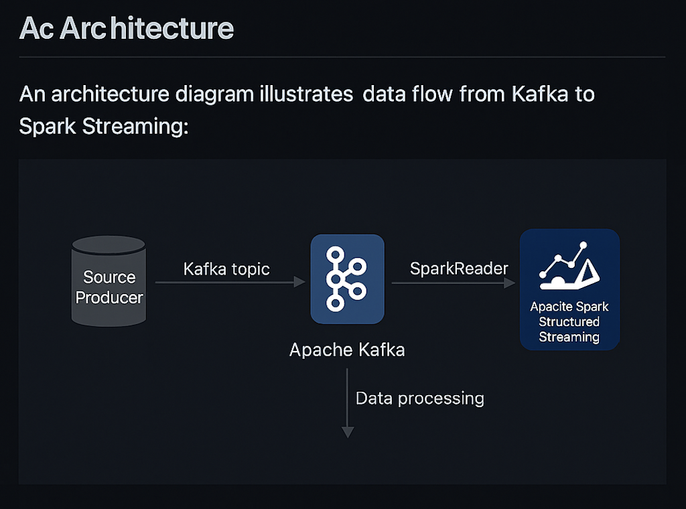

# 🔥 Scalable ML Pipeline with Apache Spark

This repository contains a modular and scalable machine learning pipeline built using **Apache Spark**. It demonstrates distributed data preprocessing, exploratory data analysis, and model training for binary classification, regression, and multiclass classification tasks using PySpark’s MLlib.

---

## 🚀 Key Features

- ✅ End-to-end data pipeline with Apache Spark (PySpark)
- ✅ Handles classification (binary & multiclass) and regression
- ✅ Feature engineering with vector assemblers and transformers
- ✅ Train/test split and evaluation with multiple metrics
- ✅ Spark DataFrame-based EDA and visualization
- ✅ Scalability for big data workloads

---

## 🛠️ Tech Stack

| Component        | Tools / Frameworks     |
|------------------|------------------------|
| Language         | Python 3.9             |
| Framework        | Apache Spark 3.x       |
| ML Library       | Spark MLlib            |
| Data Processing  | Spark SQL, DataFrames  |
| Visualization    | Matplotlib, Seaborn    |
| Deployment       | Jupyter Notebook       |

---

## 📁 Project Structure---

spark-ml-pipeline/
├── spark_classification.ipynb        # Binary & multiclass classification models
├── spark_regression.ipynb            # Regression model pipeline
├── utils/                            # Helper functions (optional)
└── README.md

## 📊 ML Workflows Included

### Binary Classification

- Logistic Regression
- Decision Tree Classifier
- Evaluation: Accuracy, Precision, Recall, F1-Score

### Multiclass Classification

- Random Forest Classifier
- Evaluation: Confusion Matrix, Accuracy, F1-Score

### Regression

- Linear Regression, Decision Tree Regression
- Evaluation: RMSE, MAE, R² Score

---

## 🖼️ Architecture Diagram

Below is the high-level architecture of the end-to-end Spark ML pipeline:

This repository contains a Spark Streaming application designed to process real-time-data from a Kafka topic. The project demonstrates a fault-tolerant, horizontally scalable streaming pipeline built using Apache Kafka and Apache Spark Structured Streaming.

The following screenshots show the streaming output, Kafka logs, and Spark Ul monitoring.

---

## 📈 Visualizations

Visuals include:

- 📌 Correlation matrix heatmaps
- 📌 Feature importance plots
- 📌 Prediction vs Actual scatter plots
- 📌 Confusion matrices

---

## 📄 License

This project is licensed under the MIT License.

---

## 👤 Author

**Samuel Pillai**  
[GitHub Portfolio](https://github.com/Samuelpillai)  
📫 ssamuelpillai@gmail.com

---